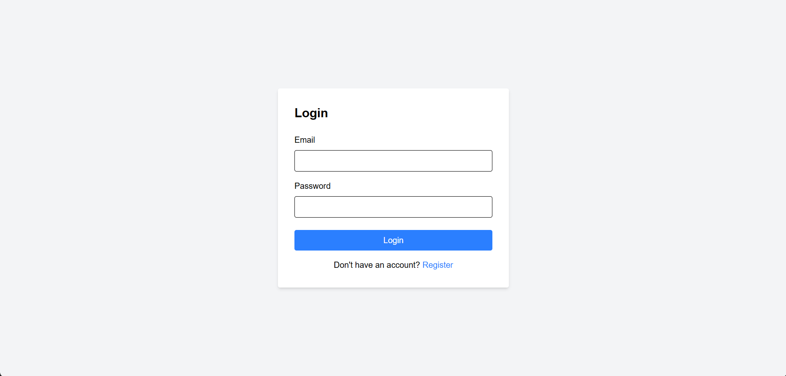
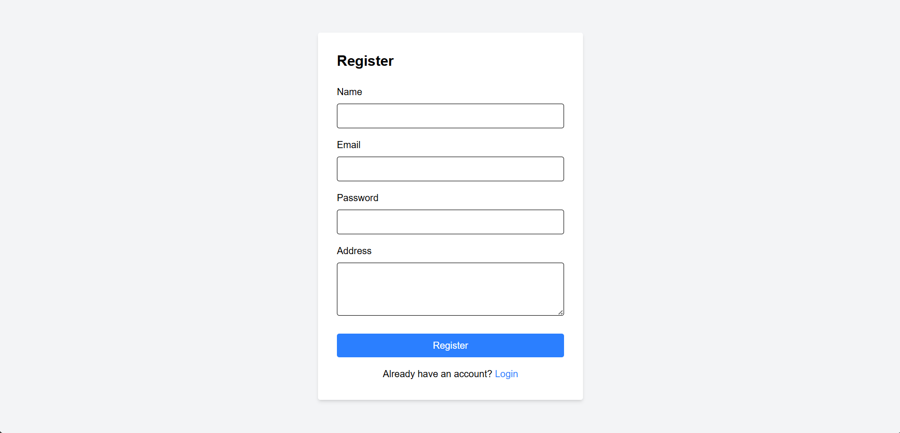
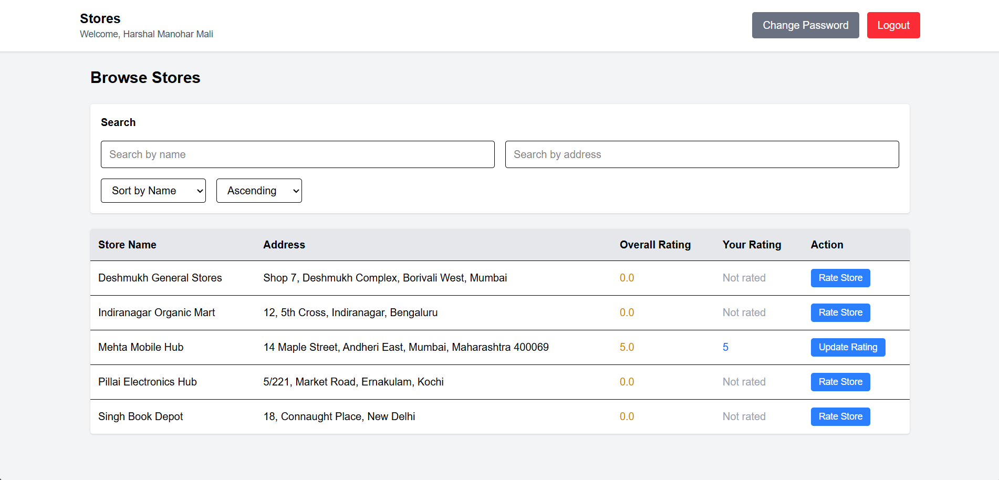
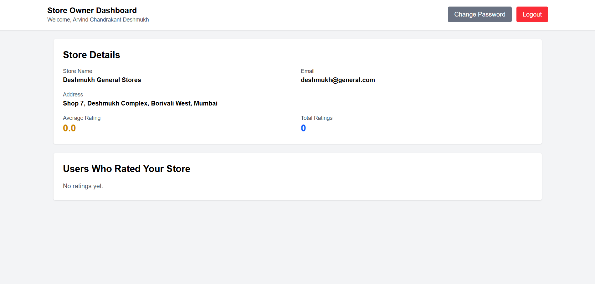
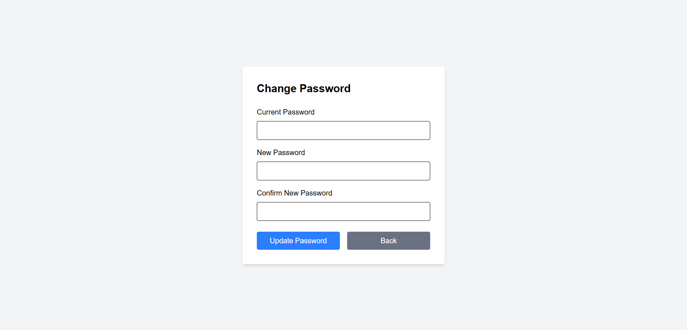

# Store Rating System - FullStack Application

A complete fullstack web application for managing stores and their ratings with role-based access control.

## Features

### User Roles
- **Admin**: Manage users, stores, and view statistics
- **Store Owner**: View their store details and ratings
- **Normal User**: Browse stores and submit ratings

### Key Functionality
- User authentication with JWT
- Role-based access control
- Store management (CRUD operations)
- Rating system (1-5 stars)
- Search and filter functionality
- Sorting capabilities
- Form validations

## Tech Stack

### Backend
- Node.js
- Express.js
- MySQL
- JWT Authentication
- Bcrypt for password hashing

### Frontend
- React.js
- Vite
- Tailwind CSS
- React Router
- Context API for state management

## Prerequisites

Before running this application, make sure you have:

- Node.js (v14 or higher)
- MySQL (v8 or higher)
- npm or yarn package manager

## Installation

### 1. Database Setup

Create a MySQL database:

```sql
CREATE DATABASE store_rating_db;
```

Run the schema file:

```bash
mysql -u your_username -p store_rating_db < backend/database/schema.sql
```

### 2. Backend Setup

Navigate to backend folder:

```bash
cd backend
```

Install dependencies:

```bash
npm install
```

Create `.env` file:

```env
PORT=5000
DB_HOST=localhost
DB_USER=your_mysql_username
DB_PASSWORD=your_mysql_password
DB_NAME=store_rating_db
JWT_SECRET=your_secret_key_here
```

Start the server:

```bash
npm start
```

Server will run on `http://localhost:5000`

### 3. Frontend Setup

Navigate to frontend folder:

```bash
cd frontend
```

Install dependencies:

```bash
npm install
```

Start the development server:

```bash
npm run dev
```

Frontend will run on `http://localhost:5173`

## Default Admin Credentials

After running the database schema, create an admin user or use:

- Email: `admin@system.com`
- Password: `Admin@123`

(Note: You need to generate bcrypt hash for the password in schema.sql)

## API Endpoints

### Authentication
- `POST /api/auth/register` - Register new user
- `POST /api/auth/login` - Login user
- `PUT /api/auth/password` - Update password

### Users (Admin only)
- `GET /api/users` - Get all users with filters
- `GET /api/users/:id` - Get user by ID
- `POST /api/users` - Create new user

### Stores
- `GET /api/stores` - Get all stores with filters
- `GET /api/stores/my-store` - Get store owner's store
- `POST /api/stores` - Create new store

### Ratings
- `POST /api/ratings` - Submit/update rating
- `GET /api/ratings/store/:storeId` - Get store ratings

### Dashboard (Admin only)
- `GET /api/dashboard/stats` - Get statistics

## Project Structure

```
store-rating-system/
├── backend/
│   ├── server.js
│   ├── config/
│   │   └── database.js
│   ├── middleware/
│   │   ├── auth.js
│   │   └── validation.js
│   ├── routes/
│   │   ├── auth.js
│   │   ├── users.js
│   │   ├── stores.js
│   │   ├── ratings.js
│   │   └── dashboard.js
│   ├── database/
│   │   └── schema.sql
│   └── package.json
│
├── frontend/
│   ├── src/
│   │   ├── components/
│   │   │   ├── Login.jsx
│   │   │   ├── Register.jsx
│   │   │   ├── AdminDashboard.jsx
│   │   │   ├── AdminUsers.jsx
│   │   │   ├── AdminStores.jsx
│   │   │   ├── UserStores.jsx
│   │   │   ├── OwnerDashboard.jsx
│   │   │   ├── ChangePassword.jsx
│   │   │   └── ProtectedRoute.jsx
│   │   ├── context/
│   │   │   └── AuthContext.jsx
│   │   ├── utils/
│   │   │   └── api.js
│   │   ├── App.jsx
│   │   ├── main.jsx
│   │   └── index.css
│   ├── index.html
│   ├── vite.config.js
│   ├── tailwind.config.js
│   └── package.json
│
└── README.md
```

## Form Validations

### User Registration
- Name: 20-60 characters
- Email: Valid email format
- Password: 8-16 characters, must include 1 uppercase and 1 special character
- Address: Maximum 400 characters

### Store Creation
- Store Name: 20-60 characters
- Email: Valid email format
- Address: Maximum 400 characters

### Rating
- Value: Must be between 1-5

## User Guide

### Admin Functions
1. Login with admin credentials
2. View dashboard with statistics
3. Manage users (create, view, filter, sort)
4. Manage stores (create, view, filter, sort)
5. Create store owners along with their stores

### Store Owner Functions
1. Login with store owner credentials
2. View store details and average rating
3. See list of users who rated the store
4. View individual ratings

### Normal User Functions
1. Register as new user
2. Login with credentials
3. Browse all stores
4. Search stores by name or address
5. Filter and sort stores
6. Rate stores (1-5 stars)
7. Update existing ratings

## Screenshots

### 1. Login Page

*Simple login interface with email and password fields*

### 2. User Registration

*Registration form with validation*

### 3. Admin Dashboard

*Admin dashboard showing total users, stores, and ratings*

### 4. Admin - Manage Users

*User management interface with filters and create user form*

### 5. Admin - Manage Stores

*Store management interface with filters*

### 6. User - Browse Stores

*User interface to browse and rate stores*

### 7. Store Owner Dashboard

*Store owner view showing store details and ratings received*

### 8. Change Password

*Password change form for all users*

## How to Add Screenshots

1. Run the application
2. Take screenshots of each page
3. Create a `screenshots` folder in project root
4. Save images with names matching the README
5. Screenshots will automatically appear in README

## Troubleshooting

### Backend Issues

**Port already in use:**
```bash
# Change PORT in .env file to different port
PORT=5001
```

**Database connection failed:**
- Check MySQL is running
- Verify credentials in .env file
- Ensure database exists

**CORS errors:**
- Check CORS configuration in server.js
- Ensure frontend URL is allowed

### Frontend Issues

**Module not found:**
```bash
# Clear node_modules and reinstall
rm -rf node_modules package-lock.json
npm install
```

**Build errors:**
```bash
# Clear cache and rebuild
npm run build
```

## Security Features

- Password hashing with bcrypt
- JWT token-based authentication
- Protected API routes
- Role-based access control
- Input validation and sanitization
- SQL injection prevention
- XSS protection

## Future Enhancements

- Email verification
- Password reset functionality
- Store image uploads
- Review comments along with ratings
- Store categories
- Advanced analytics
- Export reports
- Mobile responsive improvements

## Contributing

1. Fork the repository
2. Create feature branch (`git checkout -b feature/NewFeature`)
3. Commit changes (`git commit -m 'Add NewFeature'`)
4. Push to branch (`git push origin feature/NewFeature`)
5. Open Pull Request

## License

This project is licensed under the MIT License.

## Contact

For any queries or issues, please contact:
- Email: support@storerating.com
- GitHub: [Your GitHub Profile]

## Acknowledgments

- Express.js documentation
- React.js documentation
- Tailwind CSS documentation
- MySQL documentation

---

**Note**: This is a learning project created for educational purposes.